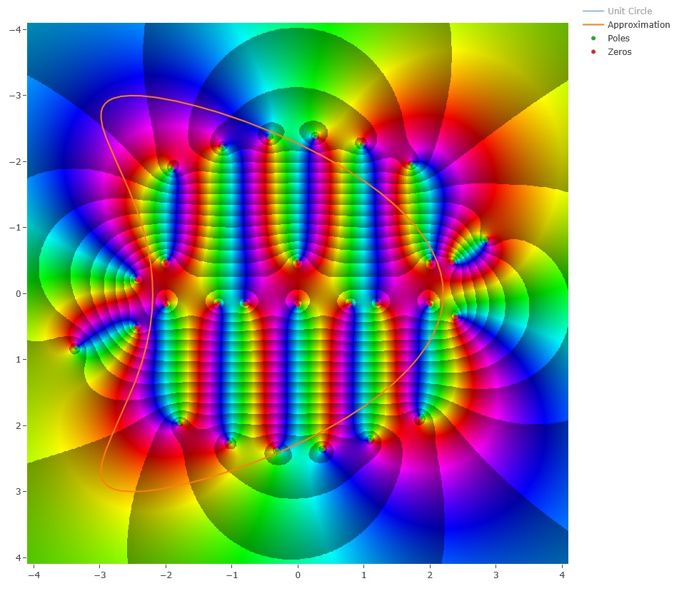

<p align="center">


A rust variant of the AAA method described in "AAA rational approximation on a continuum" 2023 (Toby Driscoll, Yuji Nakatsukasa, Lloyd N. Trefethen) 10.48550/arXiv.2305.03677 https://arxiv.org/abs/2305.03677

The method approximated single in single out functions of floating point or complex type (AAA-continuum) or fits to sets of values from a Vec (AAA-discreet)

This crate was taken down for a while for some refactoring that is mostly done, the main AAA functions are now generic over floats and Complex type but most of the supporting code like plotting and sinularaties have not been finished but are mostly implemented for f64 and Complex<f64>. Trying to get all the generics play nice is a bit of a chore...

</p>

## usage example
```rust
use aaalligator::*;

fn f_f64(x: f64) -> f64 {
    ((4.0 * x).cos() - (3.0 * x).sin()).exp()
}

    let r = f_f64.into_bary();
    r.print_info();
    r.przr().print_przr_info();
    r.draw();

```

```rust
Degree 22

Error 1.6431300764452317e-14

Nodes
-1.0
1.0
-0.06666666666666665
-0.33333333333333326
...

Values
0.5989820710380285
0.45168798828143364
3.2005541798850548
...

Weights
-0.004582229879077056
0.002435207049872172
0.06184793838124244
...

Weights * Values
-0.0027446735429419097
0.0010999537734055261
0.1979476777033588
...

Poles
Complex { re: -2.404184602256414, im: 0.0 }
Complex { re: -1.4342261649870018, im: 0.6069887446071661 }
Complex { re: -1.4342261649870018, im: -0.6069887446071661 }
Complex { re: 1.4526683103120026, im: 0.38863788302032 }
Complex { re: 1.4526683103120026, im: -0.38863788302032 }
...

Residues
Complex { re: 5.034382918460181e-9, im: 0.0 }
Complex { re: 1.1446996154852947e-8, im: 2.200502304289411e-8 }
Complex { re: 1.1446996154852947e-8, im: -2.200502304289411e-8 }
Complex { re: 4.102617540837985e-8, im: 7.146164456205166e-8 }
Complex { re: 4.102617540837985e-8, im: -7.146164456205166e-8 }
...

Zeros
Complex { re: -1.9355732206039633, im: 0.0 }
Complex { re: -1.0220808923947649, im: 0.6850924714740876 }
Complex { re: -1.0220808923947649, im: -0.6850924714740876 }
Complex { re: -0.8702320603690563, im: 0.6811911765742834 }
Complex { re: -0.8702320603690563, im: -0.6811911765742834 }
```


Complex example:

```rust
fn kite(t: Complex64) -> Complex64 {
    let input_param = t.re();

    let t = (input_param + 1.0) * 0.5 * TAU;

    let x = 2.2 * t.cos() + 1.25 * (2.0 * t).cos() - 1.25;
    let y = 3.0 * t.sin();

    Complex64::new(x, y)
}

let r = kite.into_bary();
r.draw_with_pz();
```


## bugs / todo
- fix complex genertics to use the same singularaties as f64
- why does plotly ignore my marker/line colours?
- Cleanup of poles/zeros